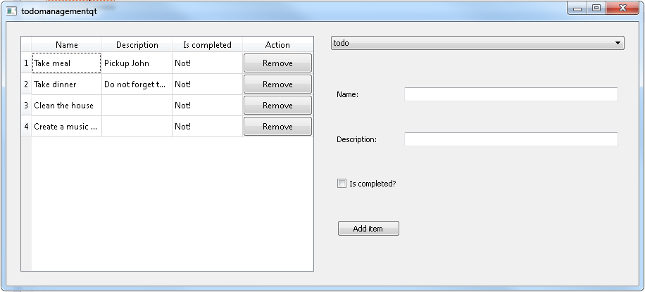

todomanagement
==============
Application is developed in C++ using Mingw32 and Qt 4.8.4 library

The application is not ready, here are some left things to be done:
<ul>
	<li>Edit item</li>
	<li>Create list</li>
	<li>Edit list</li>
	<li>Remove list</li>
	<li>Refactoring
		<ul>
			<li>View classes, forms should be separate classes, the table of items should also be a separate class</li>
			<li>Refactor ListController to handle only lists, maybe create a service or a new controller to handle items</li>
		</ul>
	</li>
</ul>